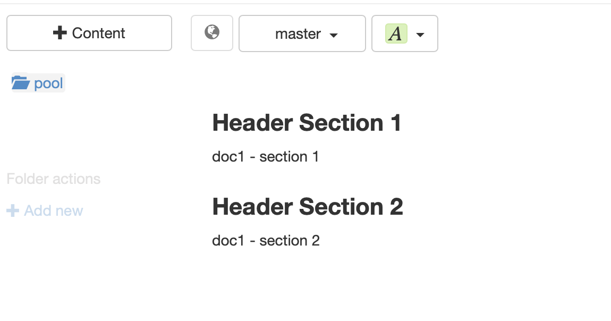

Current format version: `{{ page.version }}`

You can import CSV (comma-separated values) and TSV (tab-separated values) files onto tagtog 😻. This also means, you can easily **import any excel sheet** onto tagtog 📊.

### How it's parsed

An imported file is parsed as follows:

* **The first row is considered the header**. Each column represents a section in tagtog, and the header gives the title for each.
* **Each subsequent row represents a document**. Each column represents a paragraph in a section in tagtog, whose header is given by the corresponding header column. Content rows with a different number of columns than the header's are allowed. In case the row has less columns, everything remains equal. If the row has more columns than the header's, then a stub title for the column section is created with the pattern: `"Column-#{columnNumber}"`.

_Note_: the imported file has _at least_ 2 rows: 1 for the header, the other for the first document. Each subsequent row is another document.

👉 Would you like to upload a csv file and have it uploaded all as a single document on tagtog? 🤔 [Contact us](https://www.tagtog.net/#contact) and we can implement it.

---

#### Example

How the parsing works is best explained with an example 🙂. Say you start with an excel file (or numbers file on macOS) like the following:


<br/>
You can save the file as CSV:


<br/>
The file will look like this on a text editor:

```
Header Section 1,Header Section 2
doc1 - section 1,doc1 - section 2
doc2 - section 1,doc2 - section 2
```

<br/>
Uploading that CSV file, will result in two documents on tagtog:


<br/>
And, for example, the document 1 will look like this (note the headers in bold and the paragraphs in regular font):


