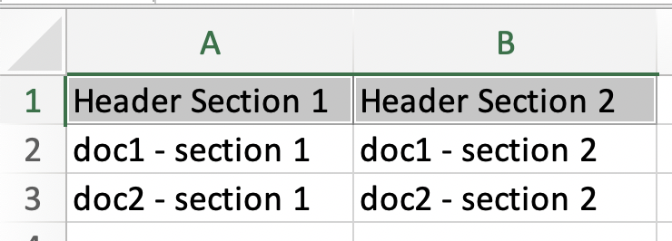
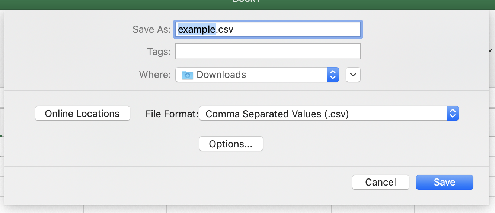
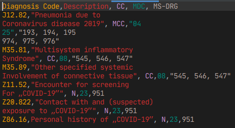
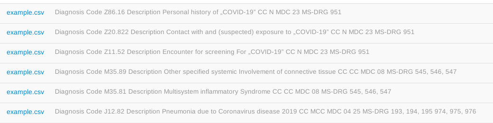
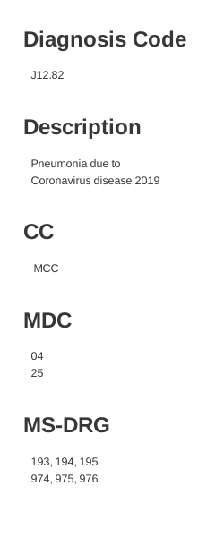

Current format version: `{{ page.version }}`

You can import CSV (comma-separated values) and TSV (tab-separated values) files onto tagtog 😻. This also means, you can easily **import an excel sheet** onto tagtog 📊.

### How it's parsed

An imported file is parsed as follows:

* **The first row is considered the header**. Each column represents a section in tagtog, and the header gives 
the title for each. Hewever one exception to the rule is accepted. If the first row starts with 
the character `#` then no titles will be created. Please note however, that the first row must exist.
* **Each subsequent row represents a document**. Each column represents a paragraph in a section in tagtog, 
whose header is given by the corresponding header column. Content rows with a different number of columns 
than the header's are allowed. In case the row has less columns, everything remains equal. 
If the row has more columns than the header's, then a stub title for the column section is created with 
the pattern: `"Column-#{columnNumber}"`. Of course, if *no titles* header was chosen, then no titles will be added
in the documents.

_Note_: the imported file has to have _at least_ 2 rows: 1 for the header and the other for the first document.
 Each subsequent row is another document.

_Note_: **the standard form of CSV/TSV files is accepted**. It means that CSV/TSV files exported from 
spreadsheets applications are accepted. It accepts the special characters like newlines inside text,
as long as they are wrapped in double quotes. If we want to import the double qoute character itself when text is already quoted, 
then the quote has to be doubled, like in the example:
```
"this is one cell value with comma (,), new lines
and ""double quote"" 
inside"
```

👉 Would you like to upload a csv file and have it uploaded all as a single document on tagtog? 🤔 [Contact us](https://www.tagtog.net/#contact) and we can implement it.

---

#### Example

How the parsing works is best explained with an example 🙂. Say you start with an excel 
file (or numbers file on macOS) like the following:



<br/>
You can save the file as CSV:



<br/>
The file will look like this in a text editor:



<br/>
Uploading that CSV file, will result in 6 documents on tagtog:



<br/>
And, for example, the first document (the last on the list) will look like this: 



Please note the headers in bold and the paragraphs in regular font. 
Also please note, that the upload preserves new lines, commas and quotes from the original
spreadsheet source.
