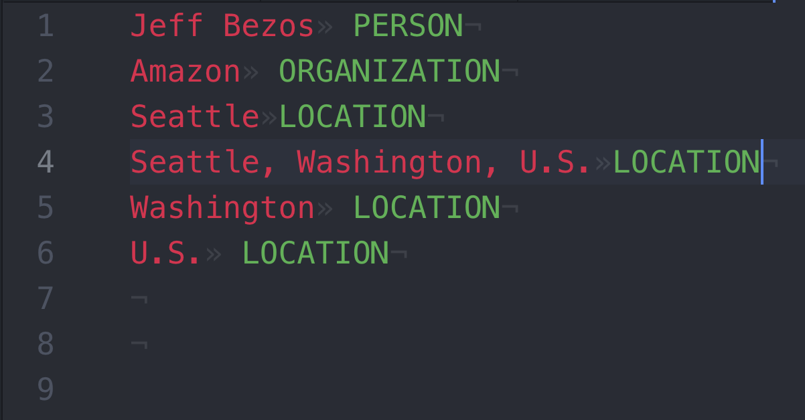

Tabulated format to represent an annotated document's **entities**. The format is a close derivative of the [EntitiesTsv](EntitiesTsv)'s, with two single but important differences:

* The (non-labeled) **"outside" text is NOT written**
* ALL labeled entities are written --> (because of this) **overlapping entities are supported**

The document text's sections (parts) are still separated by new line.

## Example

The format is best explained with an example 🙂 (contrast with that of [EntitiesTsv](EntitiesTsv)'s):

* From the annotated _input_ document (note that it contains overlapping entities):

* The resulting _output_ is (the `»` character represents a tab, `·` a space, and `¬` a new line):

