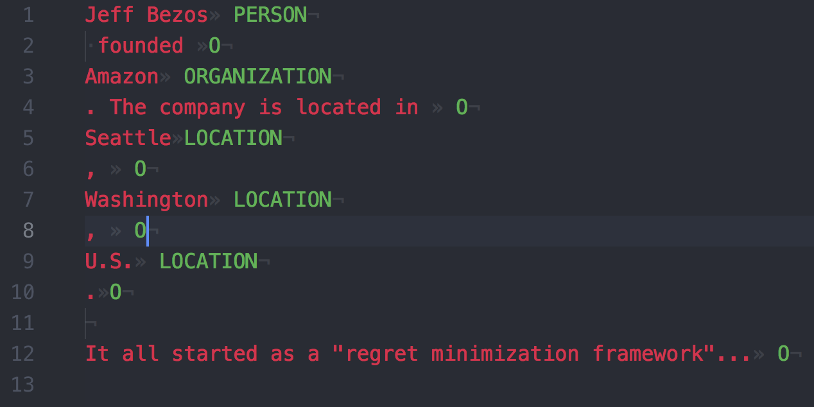
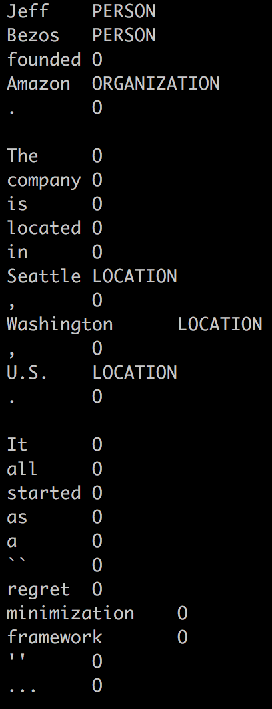

Tabulated format to represent an annotated document's **entities**. The main characteristics are:

* A document's text is divided into chunks of text, splitting annotated entities vs. non-annotated text.
* The first column has the ordered chunks of text, whereas the second column their entity labels
  * Non-annotated text is labeled as `O` (for _Outside_).
  * Annotated entity text is labeled as the corresponding entity type's name (e.g. _Person_ or _Location_).

* Annotations other than entities are not represented in this format.
* **Overlapping entities are not supported** either: when two overlapping entities are detected, the first one (as in the string start offset) is arbitrarily chosen over the other.

The `EntitiesTsv` format closely resembles the `tsv` output by the Stanford NER tool as briefly shown [here](https://nlp.stanford.edu/software/crf-faq.shtml#j) and [here (see _outputFormat_)](https://nlp.stanford.edu/software/CRF-NER.shtml). The main differences are that in `EntitiesTsv`:

* **the text is NOT tokenized**
* the spaces are preserved
* sentences are not segmented

This is to give freedom to the user to choose later any desired text tokenizer. If the user still wants to use Stanford's default tokenizer, [this is the corresponding java class](https://nlp.stanford.edu/nlp/javadoc/javanlp/edu/stanford/nlp/process/PTBTokenizer.html).

## Example

The format is best explained with an example 🙂:

* From the annotated document (_input_):

* The resulting _output_ is (the `»` character represents a tab, `·` a space, and `¬` a new line):

---

As a comparison, the Stanford NER tsv format would yield for the same text the output (as running `java -mx600m -cp ".:*:lib/*" edu.stanford.nlp.ie.crf.CRFClassifier -loadClassifier classifiers/english.all.3class.distsim.crf.ser.gz -outputFormat tsv -textFile my-sample.txt 2>/dev/null`):

